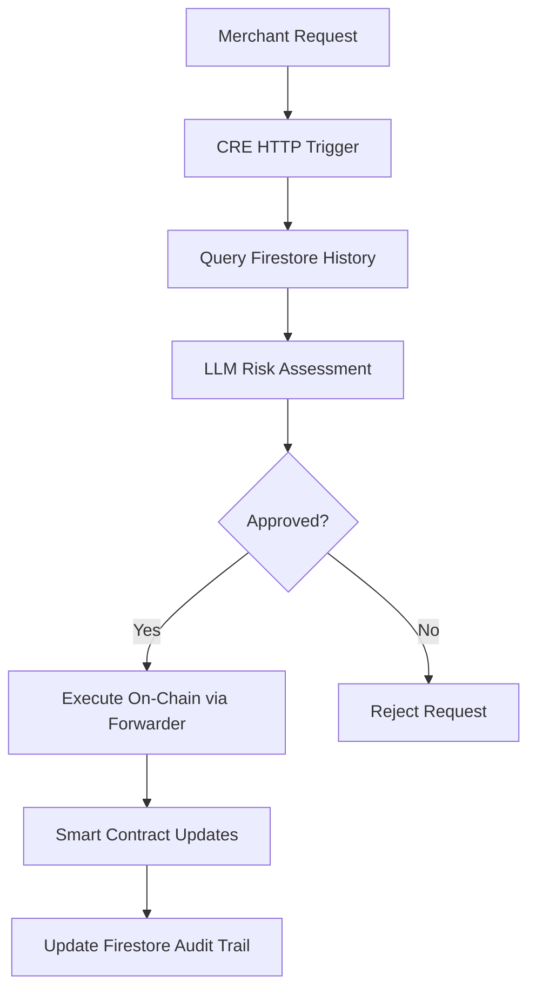

# AegisPay CRE - The AI Risk Engine & Orchestration Layer

**The off-chain intelligence powering Web3's Visa-style "Auth & Capture" payment protocol**

[](https://docs.chain.link/cre)

## 📋 Table of Contents

- [🧠 The "Visa Smart" Brain](#-the-visa-smart-brain)
- [🔄 How the HTTP Workflow Works (Auth & Increment)](#-how-the-http-workflow-works-auth--increment)
- [📊 Event Log Indexing (The Feedback Loop)](#-event-log-indexing-the-feedback-loop)
- [🚀 Local Simulation Guide](#-local-simulation-guide)
- [🗂️ Project Structure](#️-project-structure)
- [🔐 Firebase Setup](#-firebase-setup)
- [🤖 LLM Integration](#-llm-integration)
- [🔗 Related Repositories](#-related-repositories)
- [📋 Configuration](#-configuration)
- [🛡️ Security Features](#️-security-features)
- [📊 Monitoring & Analytics](#-monitoring--analytics)
- [🎯 Use Cases](#-use-cases)
- [🤝 Contributing](#-contributing)
- [🔮 Roadmap](#-roadmap)

---

## 🧠 The "Visa Smart" Brain

While the [AegisPay smart contracts](https://github.com/AegisPayments/aegis-contracts.git) serve as the **Singleton Ledger** holding user funds securely on-chain, this CRE (Chainlink Runtime Environment) workflow acts as the **intelligence layer** that makes dynamic payment authorization possible.

**The Problem**: Traditional Web3 payments force users into dangerous infinite approvals or suffer strict approval UX nightmares. Dynamic pricing services (Uber, EV charging, AI agents) become impossible without over-collateralization.

**The AegisPay Solution**: This CRE workflow brings TradFi-style security to Web3 by acting as the **AI-powered risk assessment engine** between user authorizations and on-chain execution. It securely processes payment authorizations and evaluates incremental authorization requests using LLMs to prevent fraud while enabling seamless dynamic pricing.

### Example HTTP trigger flow



---

## 🔄 How the HTTP Workflow Works (Auth & Increment)

### The Payment Authorization Flow

1. **🚨 Trigger**: Merchant hits the CRE HTTP endpoint requesting an `authorize` (new payment) or `secureIncrement` (adjustment to existing auth)

2. **🧠 Memory (Firestore)**: The workflow queries a Firestore database to fetch the user/merchant transaction history, providing crucial context for risk assessment:
   - Previous authorization patterns
   - Historical transaction amounts
   - User behavior patterns
   - Merchant capture history

3. **🤖 Reasoning (LLM)**: The workflow generates a dynamic prompt based on the merchant's on-chain category:
   - `GENERIC` - Standard merchants with basic variance rules
   - `EV_CHARGER` - High variance tolerance for charging sessions
   - `RIDE_SHARE` - Medium variance for traffic/distance changes
   - `RETAIL` - Low variance for fixed-price goods

   The LLM acts as an intelligent security guard, evaluating requests against:
   - Historical patterns
   - Risk thresholds per merchant type
   - Fraud indicators
   - Authorization variance limits

4. **⚡ Execution**: If approved, CRE safely executes the `authorize` or `secureIncrement` function on the smart contract via the **Chainlink Forwarder**, ensuring no one can bypass the AI risk engine.

### HTTP Callbacks Structure

- **[`authorize.ts`](aegis-workflow/cre-callbacks/http-callback/authorize.ts)** - Handles payment authorization with cryptographic signature verification (prefix 0x01)
- **[`secure-increment.ts`](aegis-workflow/cre-callbacks/http-callback/secure-increment.ts)** - Handles AI-powered risk assessment for payment adjustments (prefix 0x02)
- **[`http-callback.ts`](aegis-workflow/cre-callbacks/http-callback/http-callback.ts)** - Main HTTP trigger router that dispatches requests based on `functionName`

---

## 📊 Event Log Indexing (The Feedback Loop)

### Real-Time On-Chain Event Monitoring

AegisPay CRE doesn't just process requests—it maintains a **perfect audit trail** by monitoring on-chain events and syncing them back to the off-chain database.

**EVM Log Triggers** monitor for:

#### Captured Funds Events

- **Event**: `Captured(address indexed user, address indexed merchant, uint256 amount)`
- **Trigger**: When merchants capture authorized funds
- **Action**: Writes captured fund details to `captured-logs` Firestore collection
- **Handler**: [`captured-funds.ts`](aegis-workflow/cre-callbacks/log-callbacks/captured-funds.ts)

#### Funds Released Events

- **Event**: `FundsReleased(address indexed user, address indexed merchant, uint256 amount)`
- **Trigger**: When remaining authorized funds are released back to users
- **Action**: Writes release details to `funds-released-logs` Firestore collection
- **Handler**: [`funds-released.ts`](aegis-workflow/cre-callbacks/log-callbacks/funds-released.ts)

This creates a **complete audit trail** where every on-chain action is automatically logged to Firestore, keeping the off-chain database perfectly synced with on-chain reality.

---

## 🚀 Local Simulation Guide

### Prerequisites

1. **Install CRE CLI**: Follow the [Chainlink CRE installation guide](https://docs.chain.link/cre/guides/getting-started/installation)
2. **Node.js & Bun**: Ensure you have Node.js and Bun installed
3. **Firebase Setup**: Configure Firebase/Firestore (see [Firebase Setup Guide](#-firebase-setup))

### Quick Start

```bash
# Clone the repository
git clone https://github.com/AegisPayments/aegis-cre.git
cd aegis-cre/aegis-workflow

# Install dependencies
bun install

# Update environment configuration
cp config.local.json config.local.json.backup
# Edit config.local.json with your Firebase and LLM API keys
```

### Testing Framework vs CLI Commands

This repository provides two ways to test the AegisPay CRE workflow:

#### 1. **Automated Test Suite** ([testing/](testing/) directory)

Complete testing framework with signature generation, payload creation, and workflow execution:

**Run the Full Test Suite:**

```bash
cd testing
npm install
npm run test:all
```

**Individual Test Scripts:**

- **[test-signature-generation.js](testing/test-signature-generation.js)**: Generates EIP-712 signatures and creates test payloads like [authorize-test-1.json](testing/payloads/generated/authorize-test-1.json) based on samples from [signature-gen-test-samples.js](testing/payloads/samples/signature-gen-test-samples.js). Users can modify the samples to create different test scenarios.

- **[test-authorize-workflow.js](testing/test-authorize-workflow.js)**: Tests the full authorize workflow using generated payloads with valid signatures, verifying signature validation, fraud detection, and on-chain execution.

- **[test-secure-increment-workflow.js](testing/test-secure-increment-workflow.js)**: Tests AI-powered payment adjustment requests, including LLM risk assessment and dynamic authorization changes.

```bash
# Run individual test scripts
npm run test:signatures  # Generate EIP-712 signatures
npm run test:authorize   # Test authorization workflow
npm run test:secure-increment # Test secure increment workflow
npm run test:firebase    # Test Firebase connectivity
```

#### 2. **Manual CLI Commands** ([cli-simulations/](cli-simulations/) directory)

Direct CRE CLI simulation commands for manual testing and debugging:

**Generate Signatures for CLI Testing:**

```bash
# Use the minimal signature generator with sample payloads
cd testing
echo '{"user": "0x9F77cBDb561aaD32b403695306e3eea53F9B40e7", "merchant": "0x9F77cBDb561aaD32b403695306e3eea53F9B40e7", "amount": 100, "nonce": 1}' | node sig-gen-minimal.js
# Copy the output signature for use in CLI commands
```

**HTTP Trigger Simulations:**

**Test Authorization (New Payment)**:

```bash
cre workflow simulate ./aegis-workflow \
  --http-payload '{"functionName": "authorize", "user": "0x9F77cBDb561aaD32b403695306e3eea53F9B40e7", "merchant": "0x9F77cBDb561aaD32b403695306e3eea53F9B40e7", "amount": 100, "nonce": 1, "signature": "0x_YOUR_GENERATED_SIGNATURE_"}' \
  --target local-simulation --non-interactive --trigger-index 0
```

**Test Secure Increment (Payment Adjustment)**:

```bash
cre workflow simulate ./aegis-workflow \
  --http-payload '{"functionName": "secureIncrement", "merchantType": "EV_CHARGER", "user": "0x9F77cBDb561aaD32b403695306e3eea53F9B40e7", "merchant": "0x9F77cBDb561aaD32b403695306e3eea53F9B40e7", "currentAuth": 20, "requestedTotal": 25, "reason": "Battery charging session extension"}' \
  --target local-simulation --non-interactive --trigger-index 0
```

#### 3. EVM Log Trigger Simulations

- Refer to EVM Log Trigger section in [testing/README.md](testing/README.md) for getting the transaction hash to simulate captured funds and funds released events.

**Test Captured Funds Event Processing**:

```bash
cre workflow simulate ./aegis-workflow \
  --non-interactive --trigger-index 1 \
  --evm-tx-hash 0xb356c6344b026a3ee5893baced116219beb3bdfab7a6becffe1269d59161558e \
  --evm-event-index 1 \
  --target local-simulation
```

**Test Funds Released Event Processing**:

```bash
cre workflow simulate ./aegis-workflow \
  --non-interactive --trigger-index 2 \
  --evm-tx-hash 0xf247d1c4567b8e3c4f8b9e4d5c6a7b8e9f0a1b2c3d4e5f6a7b8c9d0e1f2a3b4c5 \
  --evm-event-index 1 \
  --target local-simulation
```

### Flags

Refer to the documentation in [simulation_commands.md](cli-simulations/simulation_commands.md) for detailed explanations of available flags:

- **`--broadcast`**: Execute transactions on-chain (requires funded private key)
- **`--engine-logs`**: Output detailed engine logs for debugging
- **`--non-interactive`**: Skip interactive prompts (required for scripts)

### Customizing Test Scenarios

You can modify the test samples to create different scenarios:

1. **Edit [signature-gen-test-samples.js](testing/payloads/samples/signature-gen-test-samples.js)** to change:
   - User/merchant addresses
   - Transaction amounts
   - Nonce values
   - Test scenario names

2. **Run signature generation** to create new test payloads:

   ```bash
   cd testing
   npm run test:signatures
   ```

3. **Use generated payloads** in workflow tests or CLI commands

---

## 🗂️ Project Structure

```
aegis-cre/
├── aegis-workflow/                  # Main CRE workflow
│   ├── main.ts                      # Entry point & trigger setup
│   ├── firebase.ts                  # Firestore integration
│   ├── llm.ts                       # LLM risk assessment engine
│   ├── types.ts                     # TypeScript type definitions
│   ├── config.*.json               # Environment configurations
│   └── cre-callbacks/              # CRE callback handlers
│       ├── http-callback/           # HTTP trigger handlers
│       │   ├── authorize.ts         # Payment authorization logic
│       │   ├── secure-increment.ts  # Payment adjustment logic
│       │   └── http-callback.ts     # HTTP route dispatcher
│       └── log-callbacks/           # EVM event handlers
│           ├── captured-funds.ts    # Captured event processor
│           ├── funds-released.ts    # Release event processor
│           └── index.ts             # Log callback exports
├── testing/                         # Test framework
│   ├── README.md                   # Detailed testing documentation
│   ├── run-all-tests.js            # Master test orchestrator
│   ├── test-*.js                   # Individual test modules
│   └── payloads/                   # Test payload samples
├── cli-simulations/                 # CLI test commands
│   └── simulation_commands.md       # Documented CLI commands
├── docs/                           # Documentation
│   └── firebase-setup.md           # Firebase configuration guide
└── firebase-rules                   # Firestore security rules
```

### Additional Documentation

- **[Testing Framework Guide](testing/README.md)** - Comprehensive testing documentation with examples
- **[Callback Structure Overview](aegis-workflow/cre-callbacks/README.md)** - HTTP and log callback architecture
- **[Event Monitoring Details](aegis-workflow/cre-callbacks/log-callbacks/README.md)** - EVM log trigger implementation

---

## 🔐 Firebase Setup

AegisPay CRE uses Firebase Firestore as the off-chain database for transaction history and audit logging.

### Required Collections

The workflow creates and manages these Firestore collections:

- **`authorization-logs`** - Records all payment authorizations
- **`risk-assessments`** - Stores AI risk assessment decisions
- **`captured-logs`** - Tracks fund capture events
- **`funds-released-logs`** - Records fund release events

### Security Rules

The project includes pre-configured [Firestore security rules](firebase-rules) that:

- Allow **public read access** for transparency
- Restrict **write operations** to authenticated users only
- Support the workflow's service account authentication

### Setup Instructions

For detailed Firebase configuration steps, see: **[Firebase Setup Guide](docs/firebase-setup.md)**

---

## 🤖 LLM Integration

### Supported Providers

- **Google Gemini** (recommended for cost efficiency)
- **OpenAI GPT-4** (recommended for accuracy)

### Risk Assessment Categories

The LLM evaluates requests based on merchant categories with tailored risk parameters:

| Merchant Type | Variance Tolerance | Use Cases                    |
| ------------- | ------------------ | ---------------------------- |
| `GENERIC`     | Low (5-10%)        | Standard e-commerce          |
| `EV_CHARGER`  | High (50-200%)     | Variable charging sessions   |
| `RIDE_SHARE`  | Medium (20-50%)    | Traffic/distance adjustments |
| `RETAIL`      | Very Low (0-5%)    | Fixed-price goods            |

### Fraud Detection

For authorization requests, the LLM performs fraud detection considering:

- Transaction amount patterns
- Historical user behavior
- Signature validity context
- Timing and frequency analysis

---

## 🔗 Related Repositories

- **[AegisPay Smart Contracts](https://github.com/AegisPayments/aegis-contracts.git)** - The on-chain payment protocol and singleton ledger

---

## 📋 Configuration

### Environment Variables

Copy and configure your environment:

```bash
cd aegis-workflow
cp config.local.json.example config.local.json
```

Required configuration:

- **Firebase credentials** (project ID, API key)
- **LLM API keys** (Gemini or OpenAI)
- **Ethereum private key** (for on-chain operations)
- **Contract addresses** per network

### LLM Configuration

Choose your preferred LLM provider in `config.local.json`:

```json
{
  "llmConfig": {
    "provider": "gemini", // or "openai"
    "model": "gemini-1.5-flash", // or "gpt-4"
    "apiKey": "your-api-key"
  }
}
```

---

## 🛡️ Security Features

### Multi-Layer Security

1. **Cryptographic Signatures**: All authorizations require valid EIP-712 signatures
2. **AI Risk Assessment**: LLM evaluates every transaction for fraud indicators
3. **Chainlink Forwarder**: Only CRE can execute protected smart contract functions
4. **Consensus Verification**: Every operation benefits from Chainlink DON consensus
5. **Audit Trail**: Complete transaction history stored immutably

### Fraud Prevention

- Real-time transaction pattern analysis
- Historical behavior evaluation
- Merchant category-specific risk rules
- Dynamic variance threshold enforcement

---

## 📊 Monitoring & Analytics

### Real-Time Dashboards

- **Firebase Console**: Transaction logs and user analytics
- **CRE Platform**: Workflow execution metrics and performance
- **Smart Contract Events**: On-chain activity monitoring

### Test Reports

The testing framework generates comprehensive reports:

- Transaction success/failure rates
- LLM decision analysis
- Performance benchmarks
- Error categorization

---

## 🎯 Use Cases

### Dynamic Pricing Services

- **EV Charging**: Adjust authorization based on actual energy consumption
- **Ride Sharing**: Handle traffic delays and route changes
- **Cloud Services**: Scale authorization with actual resource usage
- **AI Agent Payments**: Dynamic authorization for autonomous transactions

### Fraud Prevention

- **Pattern Recognition**: Detect unusual spending behaviors
- **Velocity Checking**: Prevent rapid-fire unauthorized transactions
- **Amount Validation**: Flag suspiciously large or small transactions
- **Historical Analysis**: Use past behavior to predict fraud risk

---

## 🤝 Contributing

1. Fork the repository
2. Create a feature branch: `git checkout -b feature/my-feature`
3. Add comprehensive tests for your changes
4. Ensure all tests pass: `npm run test:all`
5. Commit your changes: `git commit -m 'Add my feature'`
6. Push to the branch: `git push origin feature/my-feature`
7. Open a Pull Request

---

## 🔮 Roadmap

- [ ] **Multi-Chain Support**: Expand beyond Ethereum to Polygon, Arbitrum, etc.
- [ ] **Advanced ML Models**: Implement more sophisticated fraud detection algorithms
- [ ] **Real-Time Analytics**: Enhanced monitoring and alerting capabilities
- [ ] **Mobile SDK**: Native mobile integration for seamless UX
- [ ] **Merchant Dashboard**: Web interface for merchant analytics and controls

---

**Built with ❤️ using [Chainlink CRE](https://docs.chain.link/cre) - Bringing institutional-grade smart contracts to Web3 payments**
